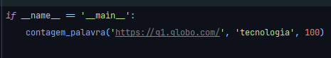
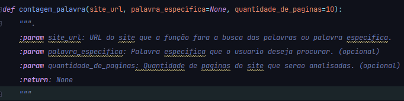
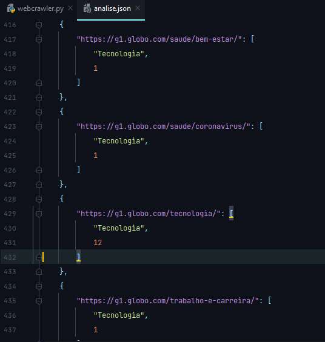

<h1 align="center">Web crawler / Rastreador web</h1>

  

<h2 align="center">Resumo</h2>
Função que simula um web crawler e pega palavras (especificas ou não) de um site e de suas paginas, tambem pode ser especificado a quantidade de paginas que serão analisadas do site. No final, cria um arquivo JSON contendo todos os dados que foram analisados.

<h2 align="center">Funcionalidades e demonstração</h2>
<h3>| Como funciona?</h3>
Este código foi feito para procurar palavras em um site e suas páginas. Com o uso dele, você poderá rastrear uma palavra específica ou exibir todas as palavras do site, ver quantas vezes cada uma foi exibida e o endereço onde elas se encontram.

<h3>| Como usar? </h3>

Para usar este programa, basta você baixar o codigo e chamar a função no seu projeto ou direto do codigo.
 

<strong>
	&nbsp;&nbsp;&nbsp;&nbsp;&nbsp;&nbsp;&nbsp;&nbsp;&nbsp;&nbsp;&nbsp;&nbsp;[ Chamando função ]
</strong>

	&nbsp;&nbsp;&nbsp;&nbsp;&nbsp;&nbsp;&nbsp;&nbsp;&nbsp;&nbsp;&nbsp;&nbsp;

&nbsp;&nbsp;&nbsp;&nbsp;&nbsp;&nbsp;&nbsp;&nbsp;&nbsp;&nbsp;&nbsp;&nbsp;A função ira procurar em 100 paginas do site "https://g1.globo.com/" a palavra "tecnologia". Apos feito esta analise, ela ira criar um &nbsp;&nbsp;&nbsp;&nbsp;&nbsp;&nbsp;&nbsp;&nbsp;&nbsp;&nbsp;&nbsp;&nbsp;arquivo JSON com o endereço onde cada palavra foi encontrada e quantas vezes a palavra foi mostrada.

<strong>
	  &nbsp;&nbsp;&nbsp;&nbsp;&nbsp;&nbsp;&nbsp;&nbsp;&nbsp;&nbsp;&nbsp;&nbsp;[ Parametros da função ]
</strong>

	&nbsp;&nbsp;&nbsp;&nbsp;&nbsp;&nbsp;&nbsp;&nbsp;&nbsp;&nbsp;&nbsp;&nbsp;

&nbsp;&nbsp;&nbsp;&nbsp;&nbsp;&nbsp;&nbsp;&nbsp;&nbsp;&nbsp;&nbsp;&nbsp;• Se você não informar uma palavra especifica, o programa ira pegar todas as palavras encontradas e colocar quantas vezes estas &nbsp;&nbsp;&nbsp;&nbsp;&nbsp;&nbsp;&nbsp;&nbsp;&nbsp;&nbsp;&nbsp;&nbsp;palavras foram mostradas em cada site 
&nbsp;&nbsp;&nbsp;&nbsp;&nbsp;&nbsp;&nbsp;&nbsp;&nbsp;&nbsp;&nbsp;&nbsp;• Se você não informar quantas paginas o programa deve analisar, o programa so ira analisar 10 paginas do site informado. 

<strong>
	 &nbsp;&nbsp;&nbsp;&nbsp;&nbsp;&nbsp;&nbsp;&nbsp;&nbsp;&nbsp;&nbsp;&nbsp;[ Arquivo JSON criado ]
</strong>

	&nbsp;&nbsp;&nbsp;&nbsp;&nbsp;&nbsp;&nbsp;&nbsp;&nbsp;&nbsp;&nbsp;&nbsp;

&nbsp;&nbsp;&nbsp;&nbsp;&nbsp;&nbsp;&nbsp;&nbsp;&nbsp;&nbsp;&nbsp;&nbsp;Mostrando o endereço onde foi encontrado a palavra e quantas vezes a palavra foi mostrada.

<h2 align="center">Tecnologias usadas</h2>

	
	
	
	
	

